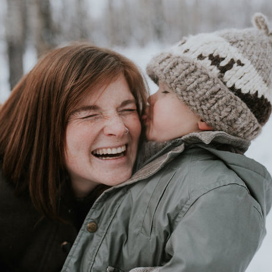

import { SEO } from "gatsby-theme-catalyst-core"

<SEO title="About Me" />

# Bio

When I was 11, I tore up a diary and threw it away because I didn’t want anyone to know what I was actually thinking. Now I make a living by putting my words in the public eye. Once I start writing, I try to keep going until I get to the place Shel Silverstein describes as “where the sidewalk ends” — that small space between what we know and what we don’t, where only words and stories can lead us.

My work often focuses on LGBTQ2S+ issues, climate, politics, mental health, and parenting. But I’m also easily drawn in by pine trees, ski tracks, anti-consumerist rants, Buffy the Vampire Slayer, and other diversions.

I’m a parent, a partner, a queer woman (she/her), a Canadian, a settler living in a glorified cabin at the seam of the foothills and the mountains on (Treaty 7) Sioux/Stoney Nakota and Blackfoot land. I’m a font snob, a coffee snob, and a recovering grammar snob.

I hated high school. But it had nothing to do with learning, and I went on to get undergrad degrees in education, politics, and English, and a Masters of education. I taught high school social studies and English for six years until my second was born in 2017. Now, I’m qualified to teach courses in advanced sleep deprivation studies and the postmodern semiotics of preschooler communication. I also help run a local Pride non-profit because free time, apparently, is boring.

No matter how sleep deprived I am, the wilderness is my retreat, and I spent over a decade leading backcountry expeditions and adventure therapy trips. My love of things literary and political always put me in the minority of outdoor instructors; stack of books and newspapers always awaited my return home off trail.

I haven’t let go of another diary since that lone unfortunate incident. Although I’m 40 with two kids and a mortgage, my old journals still take up an embarrassing amount of space in my parents’ basement; sorry, mom and dad. I hope it seems worth it now.
